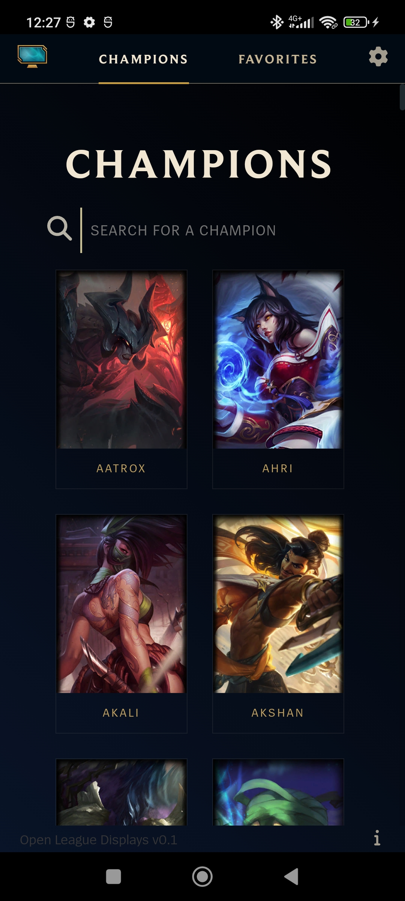
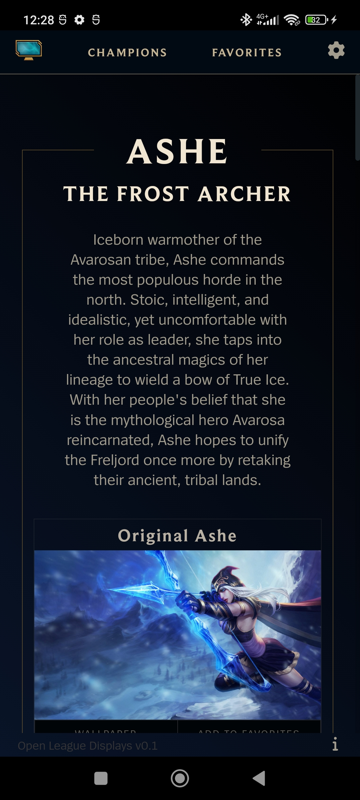
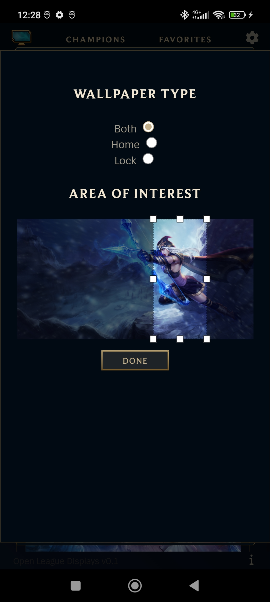

#  Android League Displays
Android League Displays is a port of [Open League Displays](https://github.com/KonstantinosPetrakis/open-league-displays), another open-source project I developed, to Android. This was achieved by leveraging [Capacitor](https://capacitorjs.com/).

With Android League Displays, you can easily set cropped high-resolution wallpapers to the home or lock screen of your Android device.





## Build for android
Given you have installed everything required for Capacitor to work with android, you simply have to: 
```
npm run auto-android-build
```
And then collect the apk file from `./android/app/build/outputs/apk/debug/`
